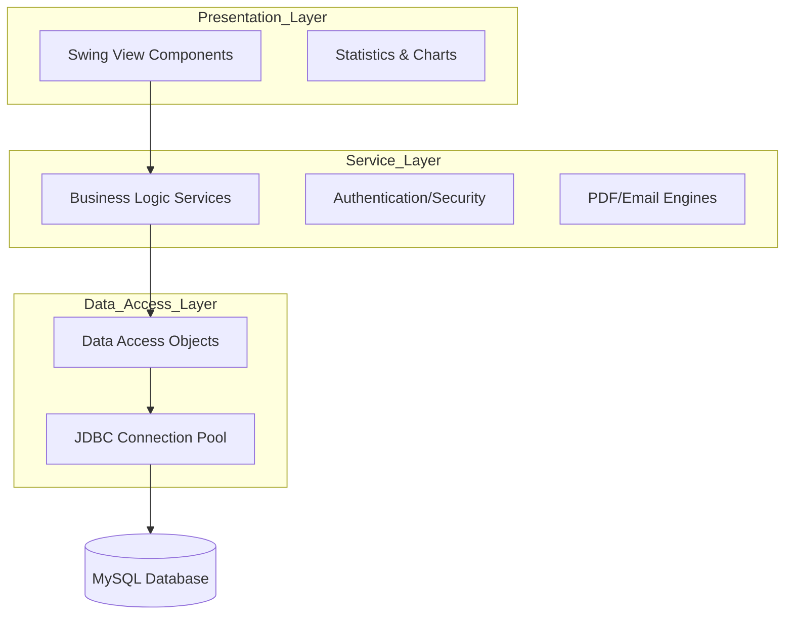

# Hotel Management System (HMS)

A robust, enterprise-grade desktop application designed to streamline hotel operations, from real-time room management to automated financial reporting. Built with Java Swing and a modular layered architecture, this system ensures high performance, maintainability, and data integrity.

## 1. Introduction
The **Hotel Management System** is a comprehensive solution for hospitality businesses seeking to digitize their workflows. It provides a centralized platform for managing guest check-ins, room availability, service billing, and revenue analytics. By leveraging a service-oriented approach, the application separates business logic from data access, providing a scalable foundation for future expansions.

## 2. Key Features
- **Interactive Room Map:** Real-time visualization of room statuses (Available, Occupied, Cleaning, Maintenance).
- **Guest Management:** Centralized database for guest profiles and stay history.
- **Automated Invoicing:** Generate professional PDF invoices using iText integration.
- **Analytics Dashboard:** Visual revenue charts and statistics for data-driven decision-making.
- **Audit Logging:** Comprehensive tracking of system activities for security and accountability.
- **Notification System:** Automated email reports and alerts via Jakarta Mail.
- **Secure Authentication:** Role-based access control (RBAC) to protect sensitive administrative data.

## 3. Overall Architecture

The project follows a **Multi-Tier Layered Architecture** to ensure strict separation of concerns.



- **Models:** Plain Old Java Objects (POJOs) representing database entities.
- **DAOs:** Abstract data persistence logic from business logic.
- **Services:** Coordinate complex operations (e.g., booking logic, financial calculations).
- **Util:** Cross-cutting concerns like Database Connectivity, PDF generation, and Session Management.

## 4. Installation

### Prerequisites
- **Java Development Kit (JDK):** Version 17 or higher.
- **MySQL Server:** Version 8.0 or higher.
- **IDE:** IntelliJ IDEA or Eclipse (recommended).

### Steps
1. **Clone the repository:**
   ```bash
   git clone https://github.com/user/quanlykhachsanjava.git
   cd quanlykhachsanjava
   ```
2. **Database Setup:**
   - Import the schema located at `src/com/hotel/hotel_management.sql` into your MySQL instance.
3. **Library Configuration:**
   - Ensure all `.jar` files in the `/lib` folder are added to your project's Build Path.

## 5. Running the Project
1. Configure the environment variables (see Section 6).
2. Locate the main entry point: `src/com/hotel/view/LoginFrame.java`.
3. Compile and run the class.
4. Use the default administrative credentials provided by your system administrator to log in.

## 6. Env Configuration
Create a `.env` file in the root directory to manage sensitive configurations. The system uses `dotenv-java` to load these properties securely.

```env
# Database Configuration
DB_URL=jdbc:mysql://localhost:3306/hotel_management
DB_USER=root
DB_PASSWORD=your_secure_password

# Email Service Configuration
EMAIL_HOST=smtp.gmail.com
EMAIL_PORT=587
EMAIL_USERNAME=admin@hotel.com
EMAIL_PASSWORD=app_specific_password
```

## 7. Folder Structure
```text
├── lib/                   # External dependencies (.jar files)
├── logs/                  # System and audit log files
├── reports/               # Generated PDF reports and invoices
├── src/
│   └── com/hotel/
│       ├── dao/           # Data Access Object interfaces
│       │   └── impl/      # JDBC implementations
│       ├── model/         # Entity classes (Guest, Room, Invoice)
│       ├── service/       # Business logic interfaces
│       │   └── impl/      # Service implementations
│       ├── util/          # Database, Email, and PDF utilities
│       ├── view/          # Swing UI components (Panels, Dialogs)
│       └── test/          # Unit and connection tests
└── .env                   # Environment configuration
```

## 8. Contribution Guidelines
We welcome contributions to improve the HMS core.
1. **Fork** the repository.
2. Create a **Feature Branch** (`git checkout -b feature/AmazingFeature`).
3. **Commit** your changes using descriptive messages.
4. **Push** to the branch.
5. Open a **Pull Request** for architectural review.

## 9. License
Distributed under the **MIT License**. See `LICENSE` for more information.

## 10. Roadmap
- [ ] **Cloud Migration:** Transition to a RESTful API with a Spring Boot backend.
- [ ] **Mobile Integration:** Develop a companion app for staff housekeeping.
- [ ] **AI Forecasting:** Implement occupancy prediction models.
- [ ] **Multi-language Support:** Localization for international hotel chains.
